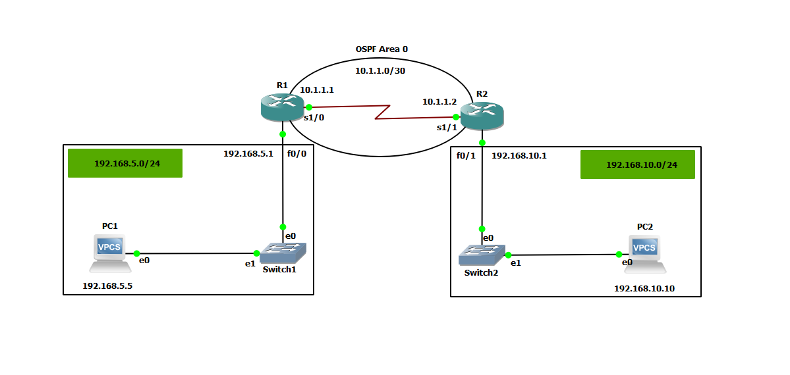

# OSPF Lab



- Router-1 Setup

```
conf t
interface fastethernet 0/0
ip address 192.168.5.1 255.255.255.0
no shutdown
exit
interface serial 1/0
ip address 10.1.1.1 255.255.255.252
no shutdown
end
show ip int br

ping 10.1.1.1
```

```
conf t
router ospf 10
network 192.168.5.0 0.0.0.255 area 0
network 10.1.1.0 0.0.0.3 area 0
end
```

- Router-2 Setup

```
conf t
interface fastethernet 0/1
ip address 192.168.10.1 255.255.255.0
no shutdown
exit
interface serial 1/1
ip address 10.1.1.2 255.255.255.252
no shutdown
end
show ip int br
show ip route

```

```
conf t
ospf router 10
network 10.1.1.0 0.0.0.3 area 0
network 192.168.10.0 0.0.0.255 area 0
end
```

- VM1 Configure

```
 ip 192.168.5.5 255.255.255.0 gateway 192.168.5.1
 
PC1> show ip

NAME        : PC1[1]
IP/MASK     : 192.168.5.5/24
GATEWAY     : 192.168.5.1
```

- VM2 Configure

```
 ip 192.168.10.10 255.255.255.0 gateway 192.168.10.1
 
PC2> show ip

NAME        : PC2[1]
IP/MASK     : 192.168.10.10/24
GATEWAY     : 192.168.10.1
```
